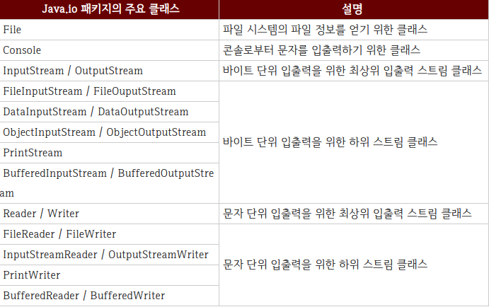
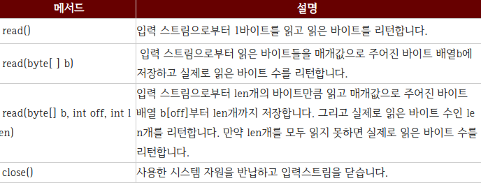
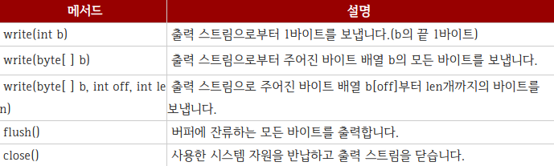

# 2021-01-20 Stream  Study

*자바 입출력과 스트림(Stream)

자바에서 데이터는 스트림(Stream)을 통해 입출력 됩니다.
스트림은 단일 방향으로 연속적으로 흘러가는 것을 말하는데 
물이 높은 곳에서 낮은곳으로 흐르듯이 데이터는 출발지에서 나와 도착지로 흘러간다는 개념입니다.
프로그램이 출발지냐 또는 도착지냐에 따라서 스트림의 종류가 결정되는데, 프로그램이 데이터를 입력받을 때에는 입력(InputStream)이라고 부릅니다.
입력스트림의 출발지는 키보드, 파일, 네트워크상의 프로그램이 될 수 있고, 
출력 스트림의 도착지는 모니터, 파일, 네트워크상의 프로그램이 될수 있습니다.


*프로그램끼리의 데이터 입출력

항상 프로그램을 기준으로 데이터가 들어오면 입력스트림이고 데이터가 나가면 출력스트림이라고 생각하시면 됩니다.
프로그램이 네트워크상의 다른 프로그램과 데이터를 교환을 하기 위해서는 양쪽 모두 입력 스트림과 출력스트림이 따로 필요합니다.
스트림은 단방향 통신을 한다는 특징이 있으므로 하나의 스트림으로 입출력을 동시에 할 수 없기 때문입니다.


*Java.io 패키지

자바의 기본적인 데이터 입출력은 Java.io 패키지에서 제공합니다. 

java.io 패키지에서는 파일 시스템의 정보를 얻기 위한 File클래스와 데이터를 입출력하기 위한 다양한 입출력 스트림 클래스를 제공합니다.



바이트 단위 입출력 스트림 : 그림, 멀티미디어, 문자등 모든 종류의 데이터들을 주고받을 수 있습니다.

문자 단위 입출력 스트림 : 오로지 문자만 주고받을 수 있게 특화되어 있습니다.

*InputStream


InputStream은 바이트 기반 입력 스트림의 최상위 클래스로 추상 클래스입니다. 
모든 바이트 기반 입력 스트림은 이 클래스를 상속받아서 만들어 집니다.
InputStream 클래스에는 바이트 기반 입력 스트림이 기본적으로 가져야 할 메소드들이 정의 되어 있습니다.



*OutputStream


OutputStream은 바이트 기반 출력 스트림의 최상위 클래스로 추상클래스입니다. 
모든 바이트 기반 출력 스트림 클래스는 이 클래스를 상속받아서 만들어집니다. 
OutputStream 클래스에는 모든 바이트 기반 출력 스트림이 기본적으로 가져야 할 메소드가 정의되어 있습니다.




#Buffered Reader / Writer Study

*버퍼란?(Buffer)
- 데이터를 한 곳에서 다른 한 곳으로 전송하는 동안 일시적으로 그 데이터를 보관하는 임시메모리 영역
- 입/출력 속도 향상을 위해 버퍼를 사용

*BufferedReader

Enter만 경계로 인식, 받은 데이터가 String으로 고정.
Scanner에 비해 다소 사용하기 불편하지만 많은 양의 데이터를 입력받을경우 BufferedReader로 입력받는 것이 효율적

1. 작업속도에 차이가 많이난다. (알고리즘의 효율성 검사에 유리)
    readLine() 리턴값은 String으로 고정
   (다른타입으로 입력을 받을려면 형변환 필요)
2. 예외처리를 꼭 해주어야한다.(보편적으로 throws IOException을 통하여 예외처리)
   (try & catch를 활용하여 예외처리 또한 가능))
   
*BufferedReader 사용법

```java 
BufferedReader bf = new BufferedReader
(new InputStreamReader(System.in));
//선언
String s = bf.readLine(); 
// 리턴값을 String으로 고정 ㅡ> 다른 타입으로 입력 받을 시 형변환 필수!
int i = Integer.parseInt(bf.readLine()); 
// int 값을 얻기위한 형변환
```


*BufferedWriter

일반적으로 출력을할때 System.out.println(""); 방식을 사용하고는 합니다. 
적은양의 출력일 경우 성능차이가 미미하겠지만 많은 양의 출력에서는 입력과 마찬가지로 Buffer를 활용해주시는것이 좋습니다.

*BufferedWriter 사용법

```java
BufferedWriter bw = new BufferedWriter
        (new OutputStreamWriter(System.out));//선언
String s = "abcdefg";//출력할 문자열
bw.write(s);//출력
bw.newLine(); //줄바꿈
bw.flush();//남아있는 데이터를 모두 출력시킴
bw.close();//스트림을 닫음
```

BufferedWriter 의 경우 버퍼를 잡아 놓았기 때문에 반드시 flush() / close() 를 반드시 호출해 주어 뒤처리를 해주어야합니다. 
그리고 bw.write에는 System.out.println();과 같이 자동개행기능이 없기때문에 개행을 해주어야할 경우에는 \n를 통해 따로 처리해주어야합니다.

