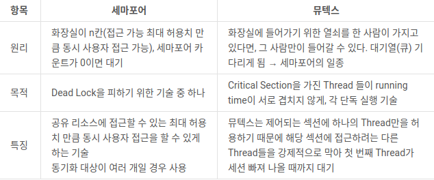

# 2021-01-25 Review & Questios Note

## 컨텍스트 스위칭

1. 컨텍스트란(Context)?
- 프로세스 : 실행중인 프로그램 또는 작업
- CPU가 프로세스를 실행하기 위해선 프로세스에 대한 정보가 필요한데 이를 Context라고 한다.
- 각 프로세스의 컨텍스트를 저장한 공간을 PCB라고 한다.
  즉, CPU가 프로세스를 실행하기 위해서 PCB에서 context를 읽어서 레지스터값 변경

2. PCB(Process Control Block)
- PCB는 운영체제의 커널 내부에 존재
- 프로세스의 생성과 동시에 생성 및 프로세스 종료 시 함께 사라짐.
- PCB저장정보 : Process ID / Register 값(PC, SP등), Scheduling Info(Process State), Memory Info(Memory Size Limit)

3. 컨텍스트 스위칭(Context Switching)
- CPU가 프로세스를 실행하고 있는 상태에서 인터럽트에 의해 다음 우선 순위를 가진 프로세스가 실행 되어야 할 때
  기존 프로세스 정보들은 PCB에 저장하고 다음 프로세스의 정보를 PCB에서 가져와 교체하는 작업
- 컨텍스트 스위칭을 하는 주체 : OS 스케쥴러
- 컨텍스트 스위칭을 통해 멀티 프로세싱 및 스레딩 운영이 가능

4. 인터럽트란
- CPU가 프로그램을 실행하고 있을 때 입/출력 하드웨어 등의 장치나 예외상황이 발생하여 처리가 필요할 경우
  마이크로프로세서에게 알려 처리할 수 있도록 하는 것

   [컨텍스트 스위칭 인터럽트의 종류]
- 입출력을 요청할 때
- CPU 사용시간이 만료되었을 때
- 자식 프로세스를 만들 때
- 인터럽트 처리를 기다릴 때

5. 컨텍스트 스위칭이 자주 일어나면 안좋은 점
- 컨텍스트 스위칭 과정에서 I/O가 발생
- 빈번한 발생은 오버헤드를 발생시켜 성능을 떨어뜨린다.
- 하지만 CPU를 계속 사용하려면 컨텍스트 스위칭은 피할 수 없기에 실행 중인 프로세스를 줄이도록 노력해야함.

## 스핀락(Spinlock)
- 스핀락은 Critical Section에 진입이 불가능할 때 진입이 가능할 때까지(busy wating - 화장실 무한 똑똑)
루프를 돌면서 재시도하는 방식의 락
- 무한 루프를 돌면서 최대한 다른 스레드에게 CPU를 양보하지 않는 것
- 상대적으로 짧은 시간 안에 끝나는 작업들에 유용 ㅡ> 컨텍스트 스위칭을 줄여 CPU의 부담을 덜어줌

## 뮤텍스(Mutex)
- 한 번에 하나의 스레드만 특정 자원에 접근해 연산
- 획득(lock), 해제(unlock) 두가지 상태가 존재(초기값 1과 0을 가짐)
- 시스템 성능에 영향을 주고 싶지 않고 오래 걸리는 작업에 유용. 주로 스레드 작업에 많이 사용

## 세마포어(Semaphore)
- 정수형으로 하나 이상의 컴포넌트가 공유자원에 접근을 제어하기 위해 사용되는 신호
- 정수형인만큼 획득과 해제 같은 명령이 아니라 값을 올리고 줄이는 방식으로 세마포어를 사용
- 최초의 s값은 1, P(s)를 먼저 수행하는 프로세스가 s=0 변경, Critical Section에 진입, 
  먼저 들어갔던 프로세스가 V(s)를 수행하면 s=1로 변경, P(s)에서 대기하고 있던 프로세스가 진행

- s=1 이면, Critical Section 실행 중 프로세스 없음 의미
- s=0 이면, Critical Section 실행 중 프로세스 있음 의미

## 세마포어와 뮤텍스의 비교

- 세마포어는 뮤텍스가 될 수 있지만 뮤텍스는 세마포어가 될 수 없다.
- 세마포어는 소유 불가, 뮤텍스는 소유가 가능 하며 소유주가 책임을 진다.
- 뮤텍스는 락을 획득 쓰레드가 뮤텍스를 해제 할 수 있다. 하지만 세마포어는 현재 수행중인 아닌 쓰레드가 세마포어를 해제 할 수 있다.
- 세마포어는 시스템 범위에 걸쳐 있고 파일시스템상 파일 형태로 존재. 반면, 뮤텍스는 프로세스 범위를 가지며 프로세스가 종료될 때 자동으로 클린업

* 가장 큰 차이점은 동기화 대상의 갯수이다. (뮤텍스 - 오직 1개 / 세마포어 - 1개 이상)

