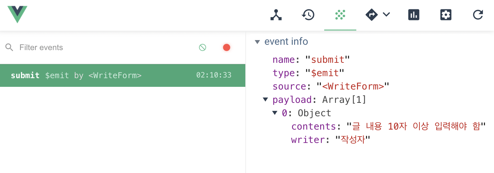
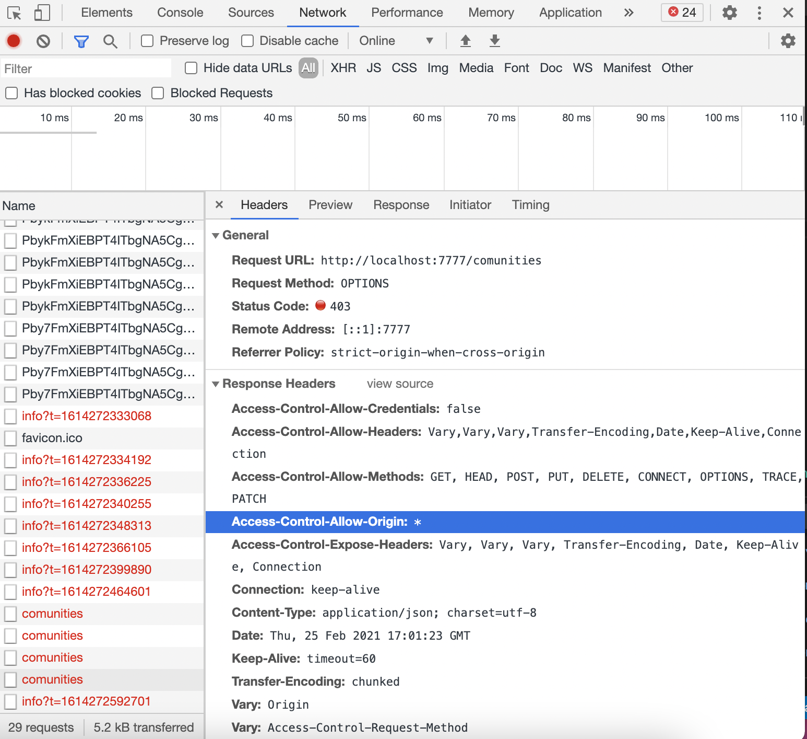
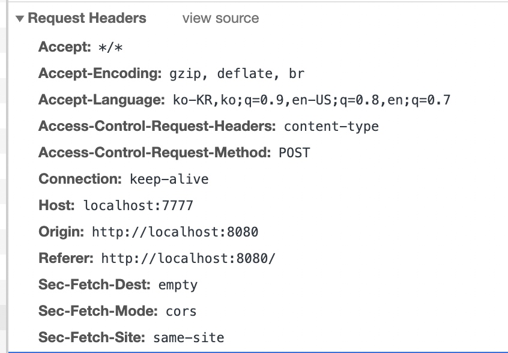

## 게사판에 글 작성 후 등록 버튼을 누르면 에러가 발생한다.

<p align="center"></p>
vue에서는 이상없이 데이터가 등록되고 있기 때문에 서버문제

# 🚨CORS ERROR🚨

```
Access to XMLHttpRequest at 'http://localhost:7777/comunities'
from origin 'http://localhost:8080' has been blocked by CORS policy:
Response to preflight request doesn't pass access control check:
No 'Access-Control-Allow-Origin' header is present on the requested resource.
```

> 7777/comunities에 정보를 요청하고 접근을 하는데 8080이 CORS 정책에 의해 막혔다

```java
// 변경 전
@Log
@RestController
@RequestMapping("/communities")
@CrossOrigin(origins = "http://localhost:8080", allowedHeaders = "*")

// 변경 후
@Log
@CrossOrigin(origins = "http://localhost:8080", allowedHeaders = "*")
@RestController
@RequestMapping("/communities")
```

어노테이션 순서를 다음과 같이 바꿔주니 오류가 사라지고 다른 오류가 나타남

> 크로스오리진 한 후에 리퀘스트 매핑 순서로 진행되어야 해서?

## 새로 나타난 error

```
Access to XMLHttpRequest at 'http://localhost:7777/comunities'
from origin 'http://localhost:8080' has been blocked by CORS policy:
Response to preflight request doesn't pass access control check: It does not have HTTP ok status.
: The value of the 'Access-Control-Allow-Origin' header in the response must not be the wildcard '*'
when the request's credentials mode is 'include'.
The credentials mode of requests initiated by the XMLHttpRequest is controlled
by the withCredentials attribute.
```

network 살펴보면 다음과 같음

<p align="center"></p>
<p align="center"></p>

request url => 7777 <br>
origin => 8080 <br>
acess-control-allow-origin => "\*"<br>
request-method => post

post하면서 터미널에 "doWrite()"가 출력되지 않는 것으로 보아 post에 오류가 있는 듯

```java
@PostMapping("")
public ResponseEntity<Community> write(
    @Validated @RequestBody Community community, UriComponentsBuilder uriBuilder) throws Exception {
    log.info("doWrite()");
    service.write(community);

    return new ResponseEntity<>(community, HttpStatus.OK);
}
```
