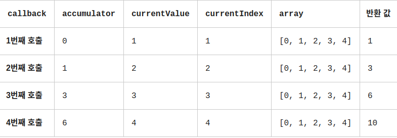

# 2021-02-02 Review Note

## 1) toLowerCase() 와 toUpperCase()

- 문자열을 소문자로 변환 = toLowerCase()
- 문자열을 대문자로 변환 = toUpperCase()

```js

// Object 정렬
let person = [
    {name: jaemin, age: 25},
    {name: mike, age: 27}
]

person.sort(function (a, b) {
        let x = a.name.toUpperCase() // 대문자로 변환 후 어순 별로 정렬
        let y = b.name.toUpperCase()

        if (x < y) { // 오름차순 정렬
            //if(x>y) // 내림차순 정렬
            return -1
        }
        if (x > y) {
            //if(x<y)
            return 1
        }
        return 0
    }
)

```

## 2) apply()

- apply는 배열 요소를 함수 매개변수로 사용해야할 때 유용

```js
    let arr = [1, 3, -7, -5, 5]

Math.max.apply(null, arr) // 5
Math.min.apply(null, arr) // -7

// this 값에 null 쓴 이유는 this와 관계 없이 동작하기 때문 즉, 무엇을 넘기든 관계 없음.

// 확산 연산자(...) 사용해도 결과 값은 동일
Math.max.apply(...arr) // 5
Math.min.apply(...arr) // -7


```

## 3) foreach()

- 배열의 요소들을 반복하여 작업을 수행
- forEach() 자체는 배열을 변경하지 않는다. (=immutable, 메모리 영역에서 변경 불가)
  단, callback 함수에 작성된 코드에 따라 배열 변경 가능.
- for 반복문으로 표현할 수 있다면 forEach()로도 표현 가능

```js
const arr = [1, 2, 3, 4, 5, 6, 7, 8, 9, 10]

arr.forEach(function (element) {
    console.log(element) // 1,2,3,4,5,6,7,8,9,10
});

arr.forEach(element => console.log(element));
//---------------------------------------------------
const arr = [1, 2, 3, 4, 5, 6, 7, 8, 9, 10]
const oddarr = []

arr.forEach(function (element) {
    if (element % 2 == 1) {
        oddarr.push(element)
    }
});

console.log(oddarr) // [1,3,5,7,9]


// callback : 각 요소를 시험할 함수. 다음 세 가지 매개변수를 받음
// currentValue : 처리할 현재 요소(필수 요소임 아래 3가지 인수는 생략가능)
// index (Optional) : 처리할 현재 요소의 인덱스
// array (Optional) : forEach()를 호출한 배열
// thisArg (Optional) : callback을 실행할 때 this로 사용할 값


```

## 4) every()

- 배열 안의 모든 요소가 주어진 판별 함수를 만족하는지 확인 (&&)

```js
const test = (currentvalue) => currentValue < 40

const arr = [2, 34, 5, 3, 39]
const arr1 = [2, 45, 5, 3, 39]

console.log(arr.every(test)) //true
console.log(arr1.every(test)) //false


```

## 5) some()

- 특정 조건에서 적어도 하나는 만족 하는지 확인(||)

```js
const test = (currentvalue) => currentValue < 40

const arr = [2, 34, 5, 3, 39]
const arr1 = [50, 45, 60, 78, 39]

console.log(arr.every(test)) //true
console.log(arr1.every(test)) //true
```

## 6) filter()

```js

const words = ['spray', 'limit', 'elite', 'establish', 'present']

const result = words.filter(word => word.length > 6); //글자 길이 6개 이상

console.log(result); // 'establish', 'present' 출력

```

## 7) find() 와 findIndex()

- find() 메서드는 주어진 판별 함수를 만족하는 첫 번째 요소의 값을 반환 그런 요소가 없다면 undefined를 반환

- findIndex() 메서드는 주어진 판별 함수를 만족하는 배열의 첫 번째 요소에 대한 인덱스를 반환 만족하는 요소가 없으면 -1 반환

```js
// * find()
const arr = [5, 12, 15, 180, 21]

const found = arr.find(element => element > 10)

console.log(found) // 12

// callback : 배열의 각 값에 대해 실행할 함수. 아래의 세 인자를 받습니다.
// element : 콜백함수에서 처리할 현재 요소
// index (Optional) : 처리할 현재 요소의 인덱스
// array (Optional) : find 함수를 호출한 배열
// thisArg (Optional) : callback을 실행할 때 this로 사용할 값


// * findIndex()

const arr1 = [5, 12, 15, 130, 21]

const isLargeNumber = (element) => element > 13;

console.log(array1.findIndex(isLargeNumber)); // 3 = 배열의 요소 [3] = 130

```

## 8) map()

- 배열 내의 모든 요소 각각에 대하여 주어진 함수를 호출한 결과를 보아 새로운 값으로 반환

```js
const arr = [1, 2, 4, 9, 10]

const map1 = arr.map(x => x * 2) //콜백함수 인자 호출

console.log(map1)
// [2,4,8,18,20]
```

## 9) reduce()

- 배열의 각요소에 대해 주어진 함수를 실행하고 하나의 결과 값을 반환

```js

const arr = [1, 2, 3];
const reducer = (accumulator, currentValue) => accumulator + currentValue;

// 1 + 2 + 3
console.log(arr.reduce(reducer));
//6

// 5 + 6
console.log(arr.reduce(reducer, 5));
// 11

// 함수 reducer는 네 개의 인자를 가짐.
// 1. 누산(acc)
// 2. 현재 값(cur)
// 3. 현재 인덱스(idx)
// 4. 원본 배열(src)
// 함수의 반환 값은 acc에 할당되고, acc는 순회 중 유지되므로 결국 하나 값으로 나옴.


//* reduce() 작동 원리
[0, 1, 2, 3, 4].reduce(function (accumulator, currentValue, currentIndex, array) {
    return accumulator + currentValue;
});

```


