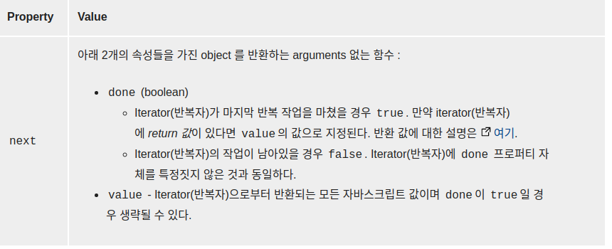
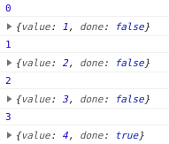

# 2021-02-03 Review Note


## Set()

- Set()은 value들로 이루어진 컬렉션("집합")
- Array와는 다르게 Set은 같은 value를 2번이상 가질 수 없음(중복 불가)
- 따라서 Set에 이미 존재 하는 값을 추가하려고 하면 발생하지 않음.

1)Set 객체 사용

```js
let mySet = new Set();

//set.add(value) = Set 객체에 주어진 값을 갖는 새로운 요소를 추가

mySet.add(1) //Set{1}
mySet.add(3)//Set{1,3}
mySet.add(5)//Set{1,3,5}

// Set.has(value) = Set 객체 내 주어진 값이 있는지 확인 후 boolean타입으로 반환
mySet.has(1) // true (boolean타입으로 출력)
mySet.has(7) // false, 7은 set에 추가되지 않았음
mySet.has(5) // true
mySet.has(Math.sqrt(25));  // true
mySet.has('Some Text'.toLowerCase()); // true
mySet.has(o); // true

// Set.size = Set 객체 내 값의 개수를 반환
mySet.size // 5
// Set.delete(value)= value와 관련된 요소 제거
mySet.delete(5) // set에서 5를 제거함
mySet.has(5) // false, 5가 제거 되었음

console.log(mySet)

```

2)Set.keys() or values()

- 기본적으로 Set의 메서드로 keys()는 존재하지 않고 values()만 존재하지만 map 오브젝트와 동일하게 동작하기 때문에 Set.values()와 같은 결과

```js
let setA = new Set();
setA.add('a');
setA.add('b');
setA.add('a');
console.log([...setA.keys()]); // ['a', 'b']
console.log([...setA.values()]); // ['a', 'b']

//--------------

let setB = new Set()
setB.add('a')
setB.add('b')
setB.add('c')

console.log(setB)

var setIter = setB.keys() // or values()

for (var key of setIter) { //setB 항목에 대해 반복
    console.log(key) // 순서대로 항목을 콘솔에 뿌린다.
}

```

3)Set.entries()

- 삽입 순으로 Set 객체 내 각 값에 대한 [value, value] 배열을 포함하는 새로운 Iterator 객체를 반환 그 key와 value에 대해 같은 값을 갖음.

```js
let setB = new Set();
setB.add('Korea');
setB.add('Japan');
setB.add('China');

let entries = setB.entries();

cosole.log(entries) // [korea,korea], [japan, japan], [china, china]
```

4)Set.foreach()

- 주어진 callback 함수를 Set에 존재하는 요소에 대해 한 번씩 실행
- Set은 키 값을 사용하지 않으므로 두 개의 매개 변수는 요소 값을 받음.

```js
 let setData = new Set()


setData.add("Cherry")
setData.add("strawberry")
setData.add("apple")

console.log(setData) //['Cherry', 'Cherry'] ㅡ> [val1, val2]

setData.forEach(function (val1, val2) { //둘 다 값을 받음
    console.log((val1 + " : " + val2))
}) // Cherry : Cherry
```

## Map()

- Map() 은 자바스크립트의 key-value 페어(pair) 로 이루어진 컬렉션
- key 를 사용해서 value 를 get, set 할 수 있음
- key 들은 중복될 수 없음: 하나의 key 에는 하나의 value 만
- key 로 사용할 수 있는 데이터형: string, symbol(ES6), object, function >> number 는 사용할 수 없음에 주의!

```js
let me = new Map(); // 새로운 map을 만들고 map에 key, value 엔트리 추가
//Map.set(key, value) = Map 객체에 주어진 key에 value를 집어 넣고 객체를 반환
//Map.get(key) = 주어진 key에 해당되는 value를 반환하고 없으면 undefined를 반환
me.set('name', 'jaemin')
me.set('age', '25')
consol.log(me.get('age')) // 25

//----------------------------------
const roomTypeMap = new Map(
    [
        ["01", "원룸(오픈형)"],
        ["02", "원룸(분리형)"],
        ["03", "원룸(복층형)"],
    ]);

    console.log(roomTypeMap.size) // 3
    console.log(roomTypeMap.get("02")) // 분리형


```

```js
let myMap = new Map()
myMap.set(0, 'zero')
myMap.set(1, 'one')

for (let [key, value] of myMap) { // set된 mymap의 key와 value를 순회하여 출력
  console.log(key + ' = ' + value)
}
// 0 = zero
// 1 = one

//Map.keys() = Map 객체 안의 모든 key들을 순회할 수 있는 Iterator객체를 반환
for (let key of myMap.keys()) { // key 값 출력
  console.log(key)
}
// 0
// 1

//Map.values() = Map 객체 안의 모든 값(Value)들을 순회할 수 있는 Iterator객체를 반환
for (let value of myMap.values()) {
  console.log(value)
}
// zero
// one


//Map.entries() = Map 객체 안의 모든 요소들을 [key, value] 형태의 array 로 순회할 수 있는 Iterator 객체를 반환.
for (let [key, value] of myMap.entries()) {
  console.log(key + ' = ' + value)
}
// 0 = zero
// 1 = one

//Map.forEach() =  key/value 쌍의 개수 만큼 주어진 함수를 순서대로 실행.
myMap.forEach(function(value, key) {
    console.log(key + ' = ' + value)
})
// 0 = zero
// 1 = one
```

##Iterable, Iterator
1)Iterable 객체
- Iterable 객체란 Symbol.iterator라는 Symbol 타입의 값을 속성으로 가지고
  그 속성의 값이 인자를 받지 않으며 iterator 객체를 반환하는 메소드인 객체를 의미. 배열은 대표적인 iterable 객체
```js
let arr = [1,2,3,4,5]

let it = arr[Symbol.iterator]();
console.log(it)
// Array Iterator()
```

2)Iterator protocol

   

3)Iterator 객체
- Iterator는 iterator protocol을 따르는 객체를 의미. iterator protocol을 따른다는 의미는 객체에 next 메소드가 존재하고, 
  그 메소드가 done과 value 속성을 가지는 객체를 반환한다는 의미
- done 속성은 순서상 값이 존재하지 않으면 true값을 가지고 값이 존재하면 false값을 가지며,
  value 속성은 순서상의 값을 의미.
- Iterator는 일반적으로 배열 Iterator로 배열의 각 값을 순서대로 반환. 배열은 완전히 할당되어야하지만 Iterator는 필요한만큼만 소모되므로
  무제한으로 표현이가능(무한반복)
```js
let arr = [1,2,3,4,5]

let it = arr[Symbol.iterator]();
console.log(it.next())
console.log(it.next())
console.log(it.next())
console.log(it.next())
console.log(it.next())
console.log(it.next())//{value : undefined , done : true}

//{value : ...1~undefined, done : ...false~true}
```

```js
const MakeRangeIterator = () => {
    function makeRangeIterator(start = 0, end = Infinity, step = 1) {
        var nextIndex = start;
        var n = 0;

        var rangeIterator = {
            next: function () {
                var result;
                if (nextIndex < end) { // 0<무한
                    result = {value: nextIndex, done: false} // 값이 무한, false
                } else if (nextIndex == end) { // 0==0
                    result = {value: n, done: true} // 0==0, 값이 발생되지 않으니 true
                } else {
                    result = {done: true}; // 위 두 조건 해당 없을 때 true
                }
                nextIndex += step; // 0+=1
                n++; // 증가
                return result;
            }
        };
        return rangeIterator;
    }

    var it = makeRangeIterator(0, 4); // makeRangeIterator 호출 1부터 4까지 인자

    var result = it.next();
    while (!result.done) { // 마지막 4는 true값을 받아 > !true > false로 변환되어 while문 수행을 하지 못하고 종료
        console.log(result.value); // 1 2 3 출력
        result = it.next();// 무한루프 방지 - 이게 없으면 항상 true로 1의 개수가 무한반복
        console.log(result) 
        
    }
} 
```

result = it.next()

console.log(result)의 콘솔 출력 값

0 출력 ㅡ> 다음 값인 1에 대한 result의 {value, done} 콘솔 출력
... 3까지 수행하여 1,2,3 출력


