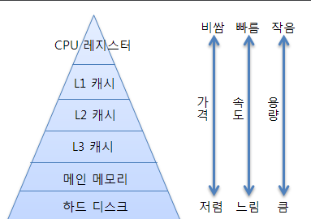
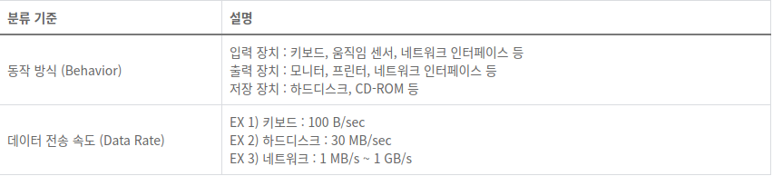

# 2021-01-25 Review & Questions Note


## 쓰레드의 동기화(Sychronization)
- 멀티쓰레드 프로세스에서는 다른 쓰레드의 작업에 영향을 미칠 수 있다.
- 진행중인 작업이 다른쓰레드에게 간섭받지 않게 하려면 '동기화'가 필요

- 한 쓰레드가 진행중인 작업을 다른쓰레드가 간섭하지 못하게 막는 것

-동기화 하려면 간섭받지 않아야 하는 문장들을 '임계 영역'(Critical Section)으로 설정

-임계영역은 mutex lock을 얻은 단 하나의 쓰레드만 출입가능(객체 1개 당 락 1개 부여)


## critical section problem을 해결 하기 위한 방법

1)Mutual exclution (상호 배제): 이미 한 프로세스가 critical section에서 작업중일 때
다른 프로세스는 critical section에 진입해서는 안 된다.

2)Progress (진행): critical section에서 작업중인 프로세스가 없다면 다른 프로세스가 critical section에 진입할 수 있어야 한다.

3)Bounded waiting (한정 대기): critical section에 진입하려는 프로세스가 무한하게 대기해서는 안 된다.


Q. 보통 현장에서 Critical Section의 문제를 해결하기 위해 동기화를 통한 mutual exclution(상호배제)를 많이 쓰는가요?

```java
* 메서드 전체를 임계 영역으로 지정

 public synchronized void plusMoney(int plus){
        int m = getMoney();

//        try {
//            Thread.sleep(80);
//        }catch (InterruptedException e){
//            e.printStackTrace();
//        }

        System.out.println("m =" + m);
        setMoney(m + plus);
    }
// 임계영역은 최소화 하여 사용 해야한다. 임계영역이 많을 수록 CPU 성능이 저하
```

2. Race Condition
- 두 개 이상의 프로세스나 스레드가 하나의 데이터를 공유할 때 데이터가 동기화 되지 않는 상황
- 간단히 말 프로세스들끼리 하나의 자원을 갖기 위해 싸우는 것
- 코드에서 이러한 문제가 발생 할 수 있는 부분을 해결하기 위해 Critical Section을 지정(동기화)하고 
위 처럼 문제를 제어하는 기법을 실행한다.
  

## Memory Hierarchy(메모리 계층 구조)
1.메모리의 범위와 종류

[메인 메모리(Main Memory)]

 거의 모든 컴퓨터가 메인 메모리로 램을 사용한다. 보다 정확히 말하면 D램(D-RAM)계열의 메모리이다.

[레지스터(Register)]

CPU 안에 내장되어 있어서 연산을 위한 저장소를 제공한다.


[캐쉬(Cache)]

캐쉬는 D램보다 빠른 S램으로 구성하는데 캐쉬는 CPU와 램 사이에서 중간 저장소 역할을 하는 메모리이다.

[하드디스크(Hard Disk)와 이외의 저장 장치들]

하드디스크는 크고 작은 파일들을 저장하기 위한 용도로 사용되지만 프로그램 실행에 있어서도 중요한 의미를 지닌다.

SD 카드, CD-ROM과 같은 I/O(Input/Output)장치들도 메모리에 해당한다.

2. 메모리 계층 구조

- 프로그램이 실행되는 동안에 메모리가 하는 역할은 데이터의 입/출력이다
- 가장 큰 차이점은 CPU를 기준으로 얼마나 멀리떨어져 있느냐이다. CPU와 가까이에 있을수록 빠르고 멀리 있을수록 속도가 느리다.
- 레지스터(CPU내부) ㅡ> 캐쉬메모리(근처) ㅡ> 메인메모리 ㅡ> 하드디스크 순으로 CPU와 점점 멀어진다.




* 레지스터 : 차지하고 있는 크기가 가장 작지만 가장 빠르다.

* L1(Level 1) 캐쉬, L2(Level 2)캐쉬, L3(Level 3)캐쉬 : 
  L1이 L2 / L3보다 CPU에 근접해있다.

* 메인 메모리 : 캐쉬보다 크지만 상대적으로 느리다.

* 하드디스크 : 가장 크지만 가장 느리다.

프로그램의 실행을 위해서 하드디스크에 있는 내용은 메인 메모리로 이동. 
그리고 메인 메모리에 있는 데이터 일부도 실행을 위해서 L2캐쉬로 이동.
마찬가지로 L2캐쉬에 있는 데이터 일부는 L1캐쉬로 이동을 하고, L1캐쉬에 있는 데이터 중에서 연산에 필요한 데이터가 레지스터로 이동
즉,모든 메모리의 역할이 피라미드 구조에서 자신보다 아래에 있는 메모리를 캐쉬(자주 사용되는 메모리의 일부를 저장해서 속도를 향상시키는 것)하기 위해서 
존재하는 것으로 이해해야함.
반대의 경우 만약 연산에 필요한 데이터가 레지스터에 존재하지 않는다면 L1캐쉬를 확인한다. L1캐쉬도 가지고 있지 않다면 L2캐쉬를 확인하게 되고, 
이곳에도 없다면 메인 메모리를 확인. 그래도 존재하지 않는다면 결국은 하드디스크에서 읽어 들이게 된다.
하드디스크에서 데이터를 찾은 후 다시 메인 메모리 L2 캐쉬 L1 캐시를 거쳐 레지스터로 데이터가 들어오게 되는데 이경우 극심한 속도저하가 발생한다.
( 캐시를 없애 중간단계를 줄이는 것이 속도가 빠르지 않냐 생각할수 있는데
L1 캐시와 L2 캐시에, 연산에 필요한 데이터가 존재할 확률이 90% 이상이다.따라서 캐시는 속도향상에 도움을 준다)


## I/O(입출력장치)

1. 개념
-  컴퓨터 내부 또는 외부의 장치와 프로그램간의 데이터를 주고받는 것을 의미
   컴퓨터에서 연산을 한다는 것은 CPU가 무언가 일을 한다는 뜻이다. 
   입출력 장치들의 I/O 연산은 I/O 컨트롤러가 담당하고, 컴퓨터 내에서 수행되는 연산은 메인 CPU가 담당한다.

2. I/O 장치의 분류



3.요소 간 연결

CPU, 메모리, I/O 컨트롤러 등 간 연결이 필요하다

Bus는 공유된 통신 채널으로 병목현상의 원인이 될 수 있다

Bus의 종류로 SATA, PCle, SCSI가 있다.

Bus의 성능을 저하하는 물리적 요인 : 회선 길이, 연결 노드 수
-> 최근엔 bus가 아닌 고속 시리얼 통신을 이용함


4.I/O관리
   
- I/O는 OS가 관리
   * 여러 프로그램이 공유하므로 보호와 스케쥴링 필요
   * 비동기 인터럽트를 발생시킴
   * I/O 프로그래밍은 복잡하므로 OS가 프로그램에 abstraction(interface) 제공


- I/O 기기는 I/O 컨트롤러 하드웨어가 관리
  * 기기로부터 데이터 송수신
  * 소프트웨어와 연산 동기화


- 컨트롤러에 내장된 레지스터
  * command(control) registers : I/O 기기 작동
  * status registers : 기기 상태와 에러 발생 표시
  * data registers : 기기로부터 데이터 송수신
    
5. I/O Bus 
   
- 컴퓨터를 구성하는 구성요소 사이에서 데이터를 주고 받기위해 사용되는 경로.

- 데이터의 종류과 역할에 따라 Address Bus, Data Bus, Control Bus로 구분.

6. Bus Interface 
   
- CPU 내에있는 I/O(입출력) 버스의 통신방식을 알고 있는 무언가 
- 버스가 어떻게 데이터를 전송하는지, 그에 대한 프로토콜 또는 통신방식을 알고있음
- CPU는 Bus Interface를 통해 Register에 저장된 Data를 I/O버스에 보내거나 받는다.
- 모든 장치에는 Bus Interface가 있다. (Controller, Adapter 라고도 불림)
- 하드웨어끼리의 Data 전송은 버스 시스템을 이용한다.
